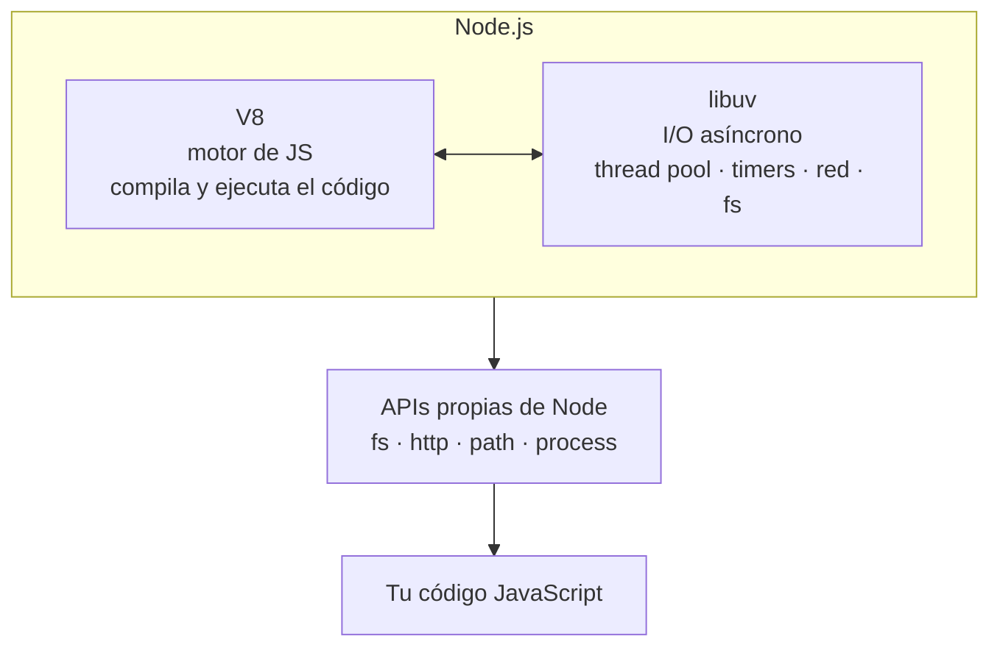

# Clase 1 — Setup y JS moderno relámpago

## Objetivos de la clase

- Dejar el entorno de trabajo instalado y funcionando (Node, npm, editor, terminal).
- Presentar el proyecto integrador del curso: **Biblioteca de préstamos de libros**.
- Repasar rápido la sintaxis moderna de JS que vamos a usar todo el curso.

## 1. ¿Qué es Node.js?

Node.js **no es un lenguaje nuevo** — es JavaScript (el mismo que corre en el navegador) ejecutándose fuera del navegador, en la máquina/servidor. Para eso combina dos piezas:

- **V8**: el motor que compila y ejecuta JS, el mismo que usa Chrome.
- **libuv**: una librería en C que le da a V8 la capacidad de hacer operaciones de entrada/salida (leer archivos, hablar por red, acceder a la DB) **sin bloquear** mientras espera la respuesta.



*(si tu editor no renderiza Mermaid, instalá la extensión "Markdown Preview Mermaid Support" en VSCode, o mirá el archivo directamente en GitHub)*

**Un poco de historia:** en 2009, Ryan Dahl presentó Node.js. El problema que quería resolver: los servidores web de la época (ej. Apache) solían usar un hilo (o proceso) por cada conexión entrante. Con miles de conexiones simultáneas, eso escalaba mal — muchos hilos esperando ociosos una respuesta de disco o de red (el llamado "problema C10K": ¿cómo atender diez mil conexiones concurrentes?). La apuesta de Node fue distinta: un solo hilo para ejecutar JS, que nunca espera bloqueado — cuando pide algo lento (leer un archivo, consultar una API), sigue con lo siguiente y atiende el resultado cuando está listo. En 2010 nace **npm**, el gestor de paquetes de Node, hoy el registro de paquetes más grande que existe.

Qué NO tiene Node que sí tiene el navegador: no hay `window`, `document`, ni DOM. Qué tiene Node que no tiene el navegador: `fs` (sistema de archivos), `http` (crear servidores), `process`, acceso a variables de entorno, etc. — APIs pensadas para correr del lado del servidor.

Por qué importa esto para lo que viene: como todo el JS corre en **un solo hilo**, cualquier cálculo síncrono pesado (un loop gigante, parsear un JSON enorme) bloquea *todo* el servidor mientras dura — no puede atender ninguna otra request en ese momento. En la próxima clase vemos en detalle cómo hace Node para no bloquearse con las operaciones de I/O.

## 2. El proyecto integrador

A lo largo de las 16 clases vamos a construir, en capas, una API REST para gestionar préstamos de libros de una biblioteca. Entidades principales:

- **Libro**: `id`, `isbn`, `titulo`, `autor`, `stock` (ejemplares disponibles), `fechaAlta`.
- **Préstamo**: `id`, `libroId`, `alumno`, `fechaPrestamo`, `fechaDevolucionEsperada`, `fechaDevolucionReal`.

Reglas de negocio que van a ir apareciendo: no se puede prestar un libro sin stock, un préstamo vencido genera una alerta, autenticación para dar de alta libros y registrar préstamos, autocompletar datos de un libro consultando una API pública por ISBN, exportar reportes en CSV.

No hace falta resolver nada de esto hoy — es el mapa de a dónde vamos.

## 3. Instalación del entorno

- **Node.js** (versión LTS). Verificar instalación:
  ```
  node -v
  npm -v
  ```
- Editor: VSCode. Extensiones recomendadas: ESLint, REST Client (o Thunder Client).
- Terminal integrada del editor — vamos a vivir ahí.

## 4. npm y package.json

- `npm init -y` crea el `package.json`: describe el proyecto y sus dependencias.
- **dependencies** vs **devDependencies**: qué se necesita en producción vs solo para desarrollar.
- `npm install <paquete>` / `npm install -D <paquete>`.
- **npm scripts**: sección `"scripts"` del package.json, se ejecutan con `npm run <nombre>`.
- `nodemon`: reinicia el proceso solo cuando guardás un archivo. Se instala como devDependency y se usa vía script (`npm run dev`).

## 5. Ejecutar código: REPL y scripts

- `node` a secas abre el **REPL** (Read-Eval-Print Loop): consola interactiva de JS.
- `node archivo.js` ejecuta un archivo completo.

## 6. JS moderno relámpago

Lo mínimo que vamos a usar todo el curso:

- **`const` / `let`**: nada de `var`. `const` por default, `let` solo si el valor se reasigna.
- **Arrow functions**: `const suma = (a, b) => a + b;`
- **Template literals**: `` `${titulo} de ${autor}` `` en vez de concatenar con `+`.
- **Destructuring** de objetos y arrays:
  ```js
  const { titulo, autor } = libro;
  const [primero, ...resto] = libros;
  ```
- **Spread / rest**:
  ```js
  const libroActualizado = { ...libro, stock: libro.stock + 1 }; // clonar sin mutar
  ```
- **Métodos de array que vamos a usar todo el tiempo**: `map`, `filter`, `find`, `reduce`.
- Mención rápida (se profundiza en la clase 3): en Node existen dos formas de organizar código en módulos, `require` (CommonJS) e `import` (ES Modules). Por ahora todo va en un solo archivo.

### Copia superficial vs copia profunda

El spread (`{...obj}`) es una **copia superficial (shallow copy)**: copia el primer nivel de propiedades, pero si algún valor adentro es a su vez un objeto o array, ese valor interno **no se copia** — la copia y el original terminan apuntando al mismo objeto anidado.

```js
const libro = { id: 1, titulo: "Rayuela", ubicacion: { estanteria: "A", fila: 3 } };

const copia = { ...libro };
copia.ubicacion.fila = 99;

console.log(libro.ubicacion.fila); // 99 — ¡se modificó el original sin querer!
```

Para copiar todo, incluidos los niveles anidados, hace falta una **copia profunda (deep copy)**. En Node moderno, la forma más simple es `structuredClone`:

```js
const copiaProfunda = structuredClone(libro);
copiaProfunda.ubicacion.fila = 1;

console.log(libro.ubicacion.fila); // 99 — el original no se tocó
```

(El truco viejo `JSON.parse(JSON.stringify(obj))` también hace deep copy, pero pierde funciones, `Date`, `undefined`, etc. — usar `structuredClone` si está disponible.)

Con los objetos planos que venimos usando (`libro` sin campos anidados) la diferencia no se nota. **Va a importar en serio en la Clase 8**, cuando armemos un DAO en memoria: si el DAO devuelve la referencia real del objeto guardado, quien llama al DAO puede mutar la "base de datos" directamente, sin pasar por ningún caso de uso ni validación. Ahí la solución va a ser que el DAO devuelva copias, no referencias.

## Cierre

La idea de hoy no es dominar todo esto, sino tenerlo fresco en la cabeza. Se va a repasar en la práctica y se va a seguir usando toda la cursada.